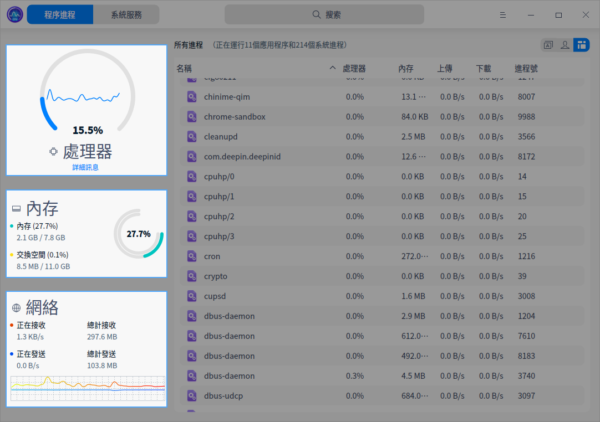
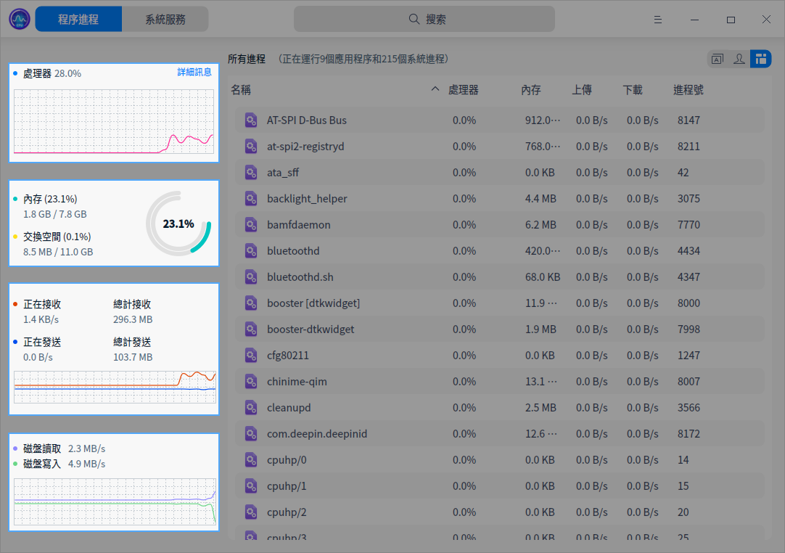
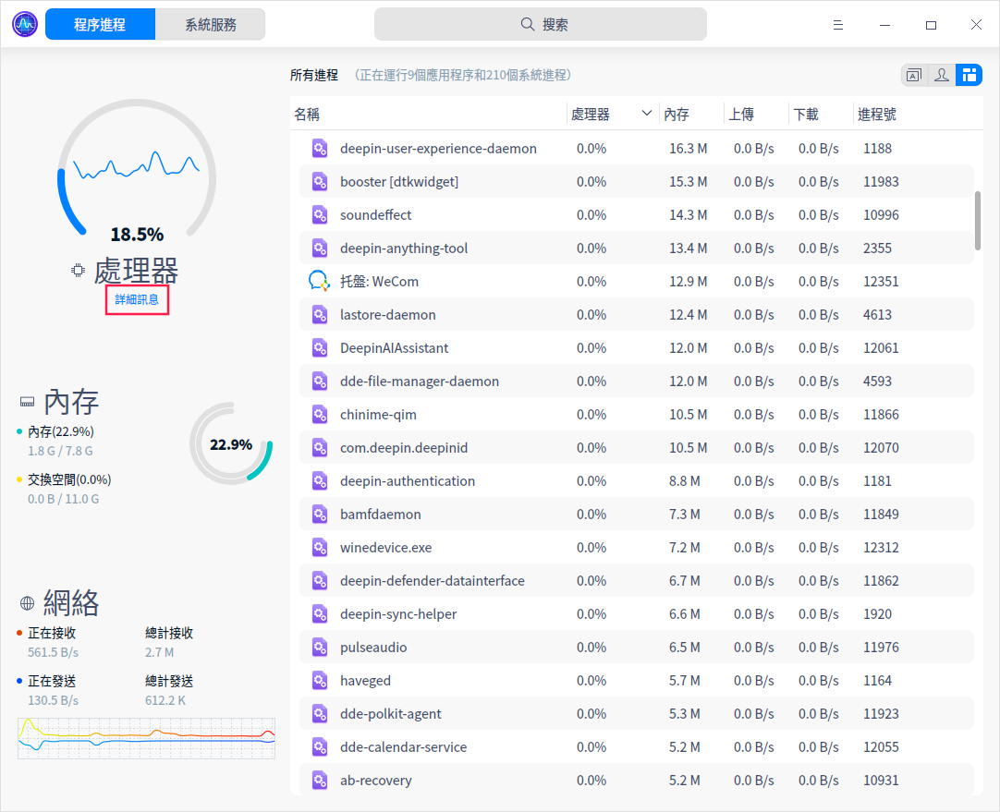
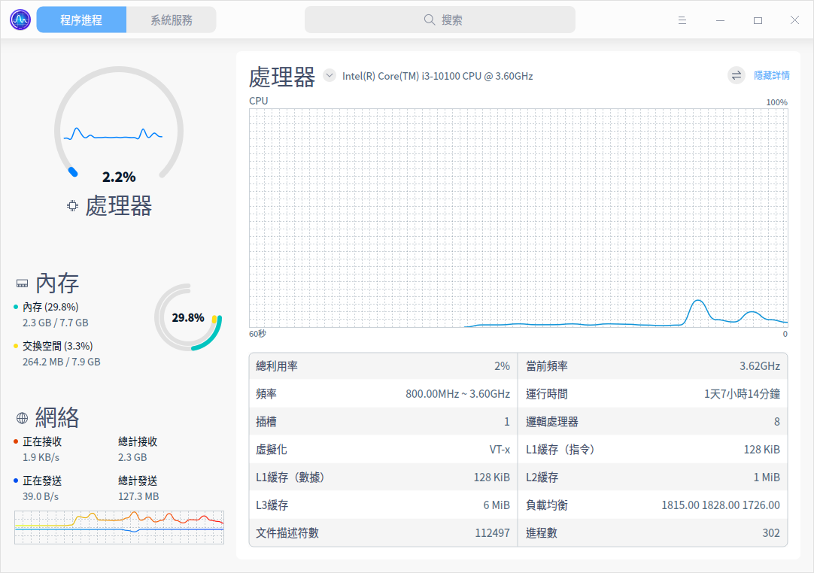
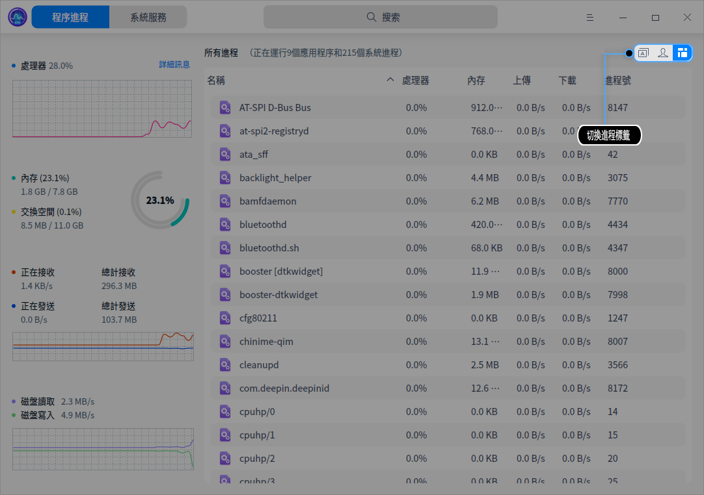
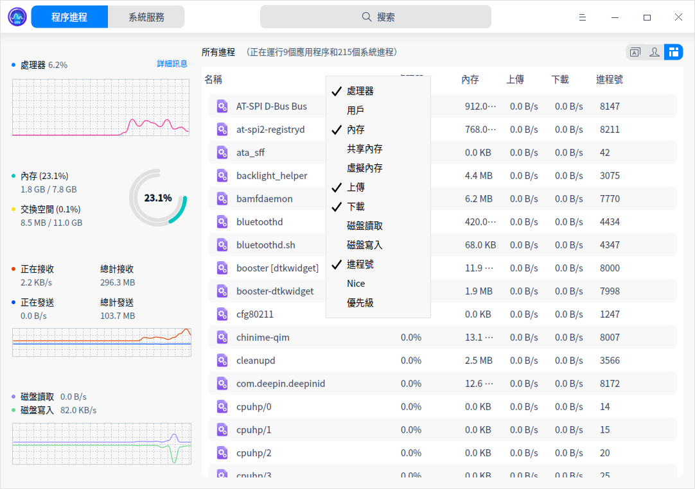
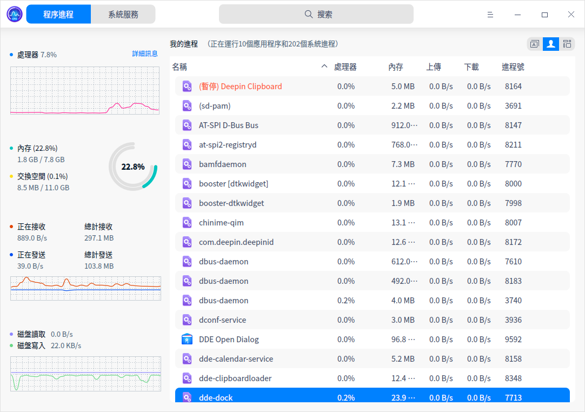
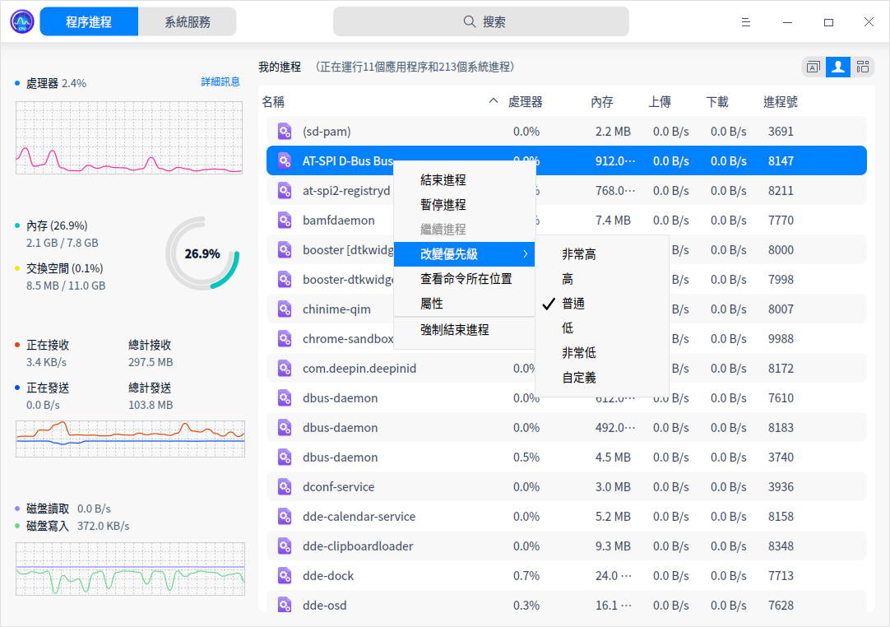

# 系統監視器|deepin-system-monitor|

## 概述

系統監視器是一個對硬件負載、程序運行、系統服務進行監測、查看和管理的系統工具。系統監視器可以實時監控處理器狀態、內存佔用率、網絡上傳下載速度、還可以管理系統進程和應用進程，也支持搜索進程和強制結束進程。

## 操作介紹

### 搜索進程

1. 在系統監視器搜索框中，單擊 。
2. 輸入關鍵字 ，實時顯示搜索結果。

### 硬件監控

在系統監視器中，單擊  > **視圖**， 選擇「舒展」或「緊湊」模式來展示電腦的處理器、內存、網絡、磁盤狀態。

| 名稱 | 說明 |
| ------------------- | ---------------|
| 處理器 |    顯示處理器最近一段時間的運行負載情況。    |
| 內存 |   顯示內存總量和當前佔用量，交換空間大小和當前佔用量。    |
| 網絡 |   實時顯示當前網絡上傳下載速度。   |
| 磁盤 |  僅在「緊湊」視圖下顯示；實時顯示當前磁盤讀取與寫入速度。  |

#### 查看硬件訊息

在舒展模式和緊湊模式下，均可以查看處理器、內存、網絡和磁盤狀態的詳細訊息。

1. 在系統監視器界面上，單擊左側 **詳細訊息**，右側默認展開處理器的詳細訊息。

2. 單擊按鈕  展開下拉菜單選項，可以選擇查看內存、網絡或磁盤的詳細訊息。

3. 單擊右側 **隱藏詳情** 收起詳情頁。

>竅門：您也可以在桌面上查看電腦的硬件狀態，具體操作步驟如下：
>1. 右鍵單擊桌面任務欄，在 **插件** 子菜單中勾選 **系統監視器**，系統插件區會顯示圖標 。
>2. 單擊插件區圖標，桌面上會展示電腦的處理器、網絡、內存、磁盤和進程狀態。
>3. 雙擊各個監視區域，打開應用並顯示對應項的詳細訊息。

### 程序進程管理

#### 切換進程標籤

單擊界面右上角的圖標切換進程標籤，分別查看應用程序、我的進程和所有進程。

- 單擊圖標  切換到 **應用程序** 頁面。
- 單擊圖標  切換到 **我的進程** 頁面。
- 單擊圖標  切換到 **所有進程** 頁面。

#### 調整進程排序

進程列表可以根據處理器、用戶、內存、共享內存、虛擬內存、上傳、下載、磁盤讀取、磁盤寫入、進程號、Nice、優先級等進行排列。

- 在系統監視器界面，單擊進程列表頂部的標籤，進程會按照對應的標籤排序，多次單擊可以切換升序和降序。
- 在系統監視器界面，右鍵單擊進程列表頂部的標籤欄，可以取消勾選標籤來隱藏對應的標籤列，再次勾選可以恢復顯示。

#### 結束進程

您可以使用系統監視器結束應用進程。

1. 在系統監視器界面，右鍵單擊需要結束的進程。
2. 選擇 **結束進程**。
3. 在彈出的對話框中單擊 **結束進程**，確認結束該進程。

>說明：您也可以在右鍵菜單中選擇 **強制結束進程**，強制結束進程可能會導致數據丟失，請謹慎操作。

#### 結束圖形化應用程序

您可以使用系統監視器來關閉桌面上圖形化的進程。

1. 在系統監視器界面，單擊 。
2. 選擇 **強制結束應用程序**。   
3. 根據螢幕提示在桌面上單擊想要關閉的應用窗口。
4. 在彈出的對話框中單擊 **強制結束**，確認結束該應用。

>說明：若要中止上述操作，可按下鍵盤上 **Esc** 鍵返回至系統監視器界面。

#### 暫停和繼續進程

您可以使用系統監視器暫停和繼續進程。

1. 在系統監視器界面，右鍵單擊一個進程。
2. 選擇 **暫停進程**，被暫停的進程會帶有暫停標籤並變成紅色。
3. 再次右鍵單擊被暫停的進程，選擇 **繼續進程** 可以繼續該進程。

#### 改變進程優先級

1. 在系統監視器界面，右鍵單擊一個進程。
2. 選擇 **改變優先級** 來進行設置。
您還可以自定義進程的優先級。

#### 查看進程路徑

1. 在系統監視器界面，右鍵單擊一個進程。
2. 選擇 **查看命令所在位置**，打開該進程的所在目錄。

#### 查看進程屬性

1. 在系統監視器界面，右鍵單擊一個進程。
2. 選擇 **屬性**，查看進程的進程名、命令行、啟動時間。

### 系統服務管理

您可以啟動、停止、重新啟動、設置啟動方式、刷新系統服務進程。
在系統服務列表，禁止強制結束應用程序。

>注意：為系統更好的運行，請勿結束系統服務自身的進程以及根進程。

#### 啟動系統服務

1. 在系統監視器界面，選擇 **系統服務** 頁簽。
2. 選中某個未啟動的系統進程，右鍵單擊 **啟動**。
3. 彈出授權對話框，請輸入密碼授權，該系統服務的活動狀態會置為「已啟動」。
4. 右鍵單擊系統進程，選擇 **設置啟動方式**，將啟動方式設置為自動或者手動。
5. 右鍵單擊 **刷新**，刷新服務列表。

   
#### 停止系統服務

1. 在系統監視器界面，選擇 **系統服務** 頁簽。
2. 選中某個已啟動的系統進程，右鍵單擊 **停止**。
3. 彈出授權對話框，請輸入密碼授權，該系統服務的活動狀態會置為「未啟動」。
4. 右鍵單擊 **刷新**，刷新服務列表。

您也可以右鍵單擊 **重新啟動**，重啟系統服務。

## 主菜單

在主菜單中，您可以切換監控模式、切換窗口主題、查看幫助手冊、了解系統監視器的更多訊息。

### 主題

窗口主題包含淺色主題、深色主題和系統主題。

1. 在系統監視器界面，單擊 。
2. 選擇 **主題**，選擇一個主題顏色。

### 視圖

系統監視器提供了舒展模式和緊湊模式，您可以根據需要選擇監控訊息的展示模式。

1. 在系統監視器界面，單擊 。
2. 選擇 **視圖**，選擇一種視圖模式。

>說明：舒展模式和緊湊模式僅在程序進程頁簽中展示。

### 幫助

查看幫助手冊，進一步了解和使用系統監視器。

1. 在系統監視器界面，單擊 。
2. 選擇 **幫助**。
3. 查看系統監視器的幫助手冊。

### 關於

1. 在系統監視器界面，單擊 。
2. 選擇 **關於**。
3. 查看系統監視器的版本和介紹。

### 退出

1. 在系統監視器界面，單擊 。
2. 選擇 **退出**。

